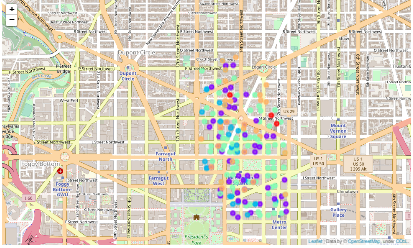
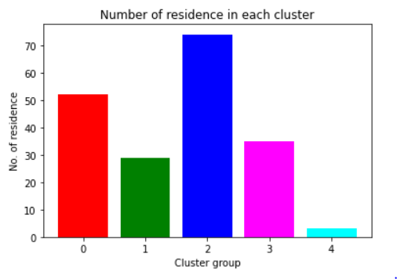

# 15 mins - City Planner

The aim of this project is to test the readiness of the city amenities where each residence can reach any necessary amenities like medical services in an emergency within the 15 minutes of timespan. This project can be further expanded to other amenities which can help in better city planning, resulting several benefits such as improved life quality, near reach of amenities causing less driving, controlling traffic and air pollution.
The primary approach in implementing such as city-wide project, depends on the neighborhood and the essential service city wants to enable the ’15min Emergency’. Here in this experiment, we will be focusing on the Downtown neighborhood of the Washington DC for the medical services available in the reach from downtown.
With the help of this experiment, we will try to answer some of the questions like:

- What is the overall current state of readiness of the city and the districts within it in respect to this "15 minutes" goal?
- Can we identify neighborhoods that share similar characteristics and group them together so that specific dedicated action plans can be defined to enable the "15 minutes" vision in these neighborhoods?

After Using the 15 minutes rule, we have clustered all the residence points on the map

And here we can see the distribution of how many elements are belonging to each cluster.

